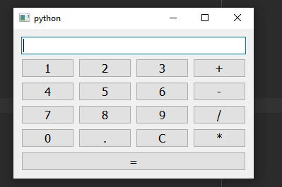

# Calculator 

A simple python calculator


```python
import sys
from PyQt5.QtWidgets import QApplication, QWidget, QLineEdit, QHBoxLayout, QVBoxLayout, QPushButton, QMessageBox
```
Arithmetic operations are performed via `eval`
```python
def _result(self):
    try:
        self.input.setText(str(eval(self.input.text())))
    except ZeroDivisionError:
        QMessageBox.about(self, "Error", "Error: Division by zero")
    except:
        QMessageBox.about(self, "Error", "Error: Enter data correctly")
        self.input.setText("")
```
Result:


